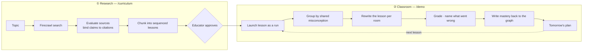

# Atrium

**Learn anything with one search.**

Atrium explores the internet, does the research for you, builds a curriculum, and then tests it in a simulated classroom before a student ever sees it.

You type a topic. Firecrawl searches the web and returns ranked sources. Atrium evaluates them, binds every claim to a citation, and chunks the material into sequenced lessons. Then it takes those lessons to a simulated class, finds out who each one fails and *why*, and rewrites tomorrow around the answer.

🥇 **1st Place Overall — Memory Meets Motion**, Devnovate @ Frontier Tower, San Francisco, August 3 2026.

🔗 Live: [atrium-web-production-164a.up.railway.app](https://atrium-web-production-164a.up.railway.app)

```bash
git clone https://github.com/nathansso/Atrium..git && cd Atrium.
npm install && npm run dev      # → http://localhost:3001
```

No keys. No Docker. The full loop runs deterministically offline in mock mode.

---

## Start here

New to the repo? These five files explain the whole system.

| Read this | To understand |
|---|---|
| [`src/server/adapters/falkorLive.ts`](src/server/adapters/falkorLive.ts) | The memory layer, and the one Cypher query the product rests on |
| [`src/server/curriculum/service.ts`](src/server/curriculum/service.ts) | Search → evaluated sources → cited curriculum draft |
| [`src/server/coreLoop.ts`](src/server/coreLoop.ts) | The classroom run, start to finish |
| [`src/contracts/events.ts`](src/contracts/events.ts) | The 11 events every layer speaks |
| [`atrium/*.pipe`](atrium/) | The four RocketRide pipelines, as deployed |

Jump to: [The two phases](#the-two-phases) · [Why a graph](#why-a-graph) · [The knowledge graph](#the-knowledge-graph) · [The stack](#the-stack) · [Lifecycle](#request-lifecycle) · [Agents](#agent-system) · [Local dev](#local-development) · [API](#api-routes)

---

## The two phases



### ① Research — `/curriculum`

Firecrawl returns ranked web results. Atrium turns them into a **reviewable draft**: concepts ordered into a prerequisite chain, evidence chunked into sequenced lessons, a comprehension check per lesson, and a citation on every claim.

Weak evidence is surfaced rather than buried. The draft carries explicit warnings for **conflicting sources**, **low-confidence claims**, **thin coverage** (a concept resting on a single source), and **stale sources** past your freshness cutoff.

`human_review_required` is hard-wired to `true` in [`curriculumResearch.ts`](src/server/agents/curriculumResearch.ts). A draft is never student-facing until an educator approves it.

### ② Classroom — `/demo`

Approving a curriculum launches each lesson as its own run against a simulated class. You find out where a lesson breaks before it is in front of anyone.

> **On "simulated."** Curriculum runs use deterministic generated submissions for the rehearsal phase. That is a demo affordance, not a claim that student work can be graded from web snippets. See [Project status](#project-status).

---

## Why a graph

Two students score 40% on integer operations. Every gradebook in existence puts them in the same remediation bucket.

They do not have the same problem.

```
Maya   ──EXHIBITED──▶  sign_error_on_negatives   ──BLOCKS──▶  integer_operations
Devan  ──EXHIBITED──▶  operation_order_slip      ──BLOCKS──▶  integer_operations
```

Maya drops the sign when a visual number line is taken away. Devan knows the signs perfectly and applies the operations out of order. **Same score, same concept, opposite intervention.** Put them in one room and at least one of them is wasting the hour.

**A misconception is not a low score, and not a missing edge — it is its own node.** `sign_error_on_negatives` exists once in the graph, and every student who exhibits it points at that same node. That is what makes grouping possible: the room is whoever shares the middle node.

Finding it means walking two hops — `Student → Misconception → Concept` — and grouping by the middle, not the endpoint. A flat table cannot express that. A vector search over "students who failed integer operations" actively hides it, because in embedding space these two students look nearly identical.

So grouping is a Cypher traversal, not a prompt:

```cypher
MATCH (s:Student)-[e:EXHIBITED]->(m:Misconception)-[:BLOCKS]->(c:Concept)
WHERE c.id IN $concepts
  AND ($runId IS NULL OR e.run_id = $runId)
WITH m, c, collect(DISTINCT s.id) AS students
WHERE size(students) >= $minGroupSize
RETURN m.id AS misconception_id, c.id AS concept_id, students
ORDER BY concept_id, misconception_id
```

Every room Atrium builds traces back to a path in the graph, and the UI shows you the path.

---

## The knowledge graph

Two subgraphs that meet at `Concept`. The research half records **where a lesson came from**. The classroom half records **who it failed and why**.

```
Source ──CITES── Lesson ──TEACHES──▶ Concept ◀──BLOCKS── Misconception ──EXHIBITED── Student
        (curriculum lineage)             ▲                    (classroom memory)
                                    HAS_MASTERY
```

Because both halves attach to the same concept nodes, you can walk from a student's misconception straight back to the web page that taught it badly — one traversal, no joins.

### Nodes

| Label | Key properties | What it is |
|---|---|---|
| `Student` | `id` | A learner |
| `Concept` | `id` | A teachable idea |
| `Misconception` | `id` | A specific wrong mental model, shared across students |
| `Room` | `id`, `name`, `run_id`, `dominant_barrier` | A temporary group, scoped to one run |
| `Support` | `id` | A delivery/accessibility support |
| `Assignment` | `id`, `run_id`, `draft_id`, `topic` | A launched curriculum |
| `Lesson` | `id`, `run_id`, `chunk_id`, `title` | One sequenced chunk of it |
| `Source` | `id`, `title`, `url`, `publisher`, `provenance`, `retrieved_at` | A page Firecrawl retrieved |

### Edges

| Edge | Properties | Notes |
|---|---|---|
| `(Student)-[:HAS_MASTERY]->(Concept)` | `score`, `confidence`, `trend`, `updated_at` | **Current** estimate, merged in place |
| `(Student)-[:MASTERY_AT]->(Concept)` | same four | **Append-only history** — one edge per write, this is the trajectory |
| `(Student)-[:EXHIBITED]->(Misconception)` | `run_id`, `evidence_refs`, `at` | Append-only; `evidence_refs` points at the actual work |
| `(Misconception)-[:BLOCKS]->(Concept)` | — | Why the misconception matters |
| `(Student)-[:NEEDS]->(Support)` | — | Never written automatically |
| `(Student)-[:MEMBER_OF]->(Room)` | `run_id` | Per-run, so rooms dissolve and re-form |
| `(Room)-[:FOCUSES_ON]->(Concept)` | — | |
| `(Assignment)-[:CONTAINS]->(Lesson)` | — | |
| `(Lesson)-[:TEACHES]->(Concept)` | — | |
| `(Lesson)-[:CITES]->(Source)` | — | Provenance as a real relationship, not serialized JSON |

Queries that matter, all in [`falkorLive.ts`](src/server/adapters/falkorLive.ts):

- `findSharedBarriers()` — the two-hop traversal that forms rooms
- `masteryTrajectory()` — one student over time; the "memory compounds" story
- `curriculumEvidence()` — lesson → source lineage for the evidence panel
- `neighborhood()` — the slice powering the on-screen graph

---

## The stack

Each layer owns exactly one job. The boundaries are deliberate.

| Layer | Technology | Owns | Removing it breaks |
|---|---|---|---|
| **Research** | Firecrawl | Web retrieval and source grounding | Curriculum authoring — there is nothing to teach |
| **Memory** | FalkorDB | The knowledge graph | Room formation — grouping *is* a traversal |
| **Live** | LaserData | One Apache Iggy topic per run | The event spine and all replay |
| **Motion** | RocketRide | Four pipelines, plus all graph/stream reads and writes | Assignment flow and durable classroom state |
| **Control** | Guild.ai | Agents, handoffs, human gates, traces | Coordination and accountable decisions |

### Firecrawl — research

`/search` returns ranked results, not structured claims, so the live adapter grounds one claim per result and assigns it to an evidence-matched concept. The mapping is deterministic: a result only joins a concept when the terminology appears **in that result**, so the system never invents an unsupported topic. Every source-level citation survives into the draft. See [`firecrawlLive.ts`](src/server/adapters/firecrawlLive.ts).

### FalkorDB — memory

Covered above. The graph compounds: every run writes new edges, and the next run reads them.

### LaserData — live

One Iggy topic per run. Append-only, partitioned, ordered within a partition, durable offsets.

Two things flow through it: **inbound**, student activity as it happens; **outbound**, every agent event, forwarded to the browser over SSE. Because the log is offset-addressed, **replay is free** — the UI scrubber reads real offsets rather than replaying a client-side array. Delivery is at-least-once, so every handler is idempotent.

### RocketRide — motion

Four pipelines, defined in [`atrium/`](atrium/) and deployed as-is. **Each is fed by the decision before it — no job restarts from the topic.**

| Pipeline | Input | Output |
|---|---|---|
| [`concept-extraction`](atrium/concept-extraction.pipe) | Uploaded assignment (PDF/image → OCR → NER) | Concepts, objectives, difficulty, constraints |
| [`variant-generation`](atrium/variant-generation.pipe) | `{ room_barrier, focus_concepts, base_assignment }` | A room-level variant preserving objective and rigour |
| [`misconception-explanation`](atrium/misconception-explanation.pipe) | Wrong answer + student history | Classified misconception with evidence |
| [`lesson-plan-synthesis`](atrium/lesson-plan-synthesis.pipe) | `{ largest_gap_concept, room_sizes, class_concept_averages }` | Next-day timeline for professor and TA |

Read those two input shapes side by side: the grouping agent names a room's barrier, and that barrier is literally the pipeline's input. The assessment agent updates mastery, and that updated state is literally what tomorrow's plan is built from.

### Guild.ai — control

Specialist agents rather than one oversized prompt: a registry, per-agent permissions, explicit handoffs, and **human-in-the-loop gates**.

Two gates are mandatory and cannot be configured away:

- A low-confidence grade never publishes; it pauses and waits for a human.
- The final lesson plan requires educator approval before it is issued.

### A deliberate constraint

The Laser SDK also ships a knowledge graph, a KV store, and a full agent runtime. Atrium uses **only its streaming layer**.

This is not an oversight. If Laser held the graph, FalkorDB would be a decorative import; if Laser ran the agents, Guild.ai would be. Using one vendor's convenience surface to absorb another's job is how you end up with five logos and two integrations.

---

## Request lifecycle

```
—— research ——————————————————————————————————————————————
1.  POST /api/curriculum/research      Firecrawl → sources + claims
2.  Curriculum Research agent          concepts, chunks, checks, citations, warnings
3.  POST /api/curriculum/:id/approve   educator gate — mandatory
4.  POST /api/curriculum/:id/launch    one Assignment + run per lesson (idempotent)

—— classroom —————————————————————————————————————————————
5.  assignment.uploaded                → Laser, Iggy topic ensured
6.  RocketRide concept_extraction      file → OCR/NER → concepts
7.  assignment.concepts.extracted      → Laser → SSE → world reacts
8.  FalkorDB findSharedBarriers()      two-hop traversal over history
9.  student.context.ready
10. Grouping agent proposes rooms      grouped by barrier, not score
11. groups.proposed                    → rooms rise in the world
12. Accessibility agent adds overlays  delivery only, objectives fixed
13. accessibility.layers.ready
14. RocketRide variant_generation      one variant per room
15. assignment.variants.ready          → morph panel animates
16. Students submit                    → Laser ingestActivity()
17. submissions.received
18. Assessment agent grades            confidence scored per item
19. approval.requested                 → Guild gate, run PAUSES
        ↓ human clicks approve
20. assessment.completed
21. FalkorDB upsertMastery()           new edges written; memory compounds
22. student.models.updated             → students move between rooms
23. RocketRide lesson_plan_synthesis
24. lesson.plan.ready                  → tomorrow's school appears
25. POST /api/runs/:id/next-lesson     the next chunk, against a changed class
```

All 11 event types are Zod-validated in [`src/contracts/events.ts`](src/contracts/events.ts):

```
assignment.uploaded              submissions.received
assignment.concepts.extracted    assessment.completed
student.context.ready            student.models.updated
groups.proposed                  lesson.plan.ready
accessibility.layers.ready       approval.requested
assignment.variants.ready
```

Every event carries `event_id`, `run_id`, `source_agent`, `timestamp`, and a typed payload.

### Platform boundaries

[`rocketRideDataPlane.ts`](src/server/platform/rocketRideDataPlane.ts) is the only application-facing route to FalkorDB and LaserData. [`guildWorkflow.ts`](src/server/platform/guildWorkflow.ts) is the application-facing route to Guild agents, gates, and traces. Provider adapters are internal SDK drivers only.

### Failure behavior

`resolveAdapterMode()` decides **per adapter**, on every boot:

```
SPONSOR_MODE=mock                    → mock         (default; fully offline)
SPONSOR_MODE=live + keys present     → live
SPONSOR_MODE=live + keys missing     → mock + one-time warning
```

A missing key degrades one layer. It never takes down the run — venue wifi failing should cost a sponsor integration, not the presentation. `getAdapterStatus()` in [`src/server/adapters/index.ts`](src/server/adapters/index.ts) reports what each layer actually resolved to, so what you see on stage is what is really running.

---

## Agent system

Nine agents: one authors the curriculum, eight run the classroom.

| Agent | Responsibility |
|---|---|
| **Curriculum Research** | Turns retrieved sources into a cited, sequenced draft; flags weak, conflicting, thin, and stale evidence |
| **Assignment Architect** | Reads the lesson, extracts objectives, maps questions to concepts, preserves constraints |
| **Student Memory** | Retrieves concept-relevant mastery, misconceptions, supports, and scaffolds from the graph |
| **Grouping** | Forms three or four explainable rooms from shared barriers |
| **Accessibility** | Adds delivery supports without altering documented accommodations or lowering expectations |
| **Assignment Curator** | Produces room-level variants plus student overlays, with objective-preservation checks |
| **Assessment** | Grades submissions, classifies misconceptions, scores confidence, routes uncertain work to review |
| **Classroom Evolution** | Updates mastery, misconception confidence, scaffolding, and room membership |
| **Lesson Planner** | Turns classroom state into an evidence-backed next-day timeline |

Two agents — Assignment Architect and Student Memory — are active from the moment a run starts. The rest register up front and activate when their stage is reached.

Mastery updates use **Bayesian Knowledge Tracing** ([`src/server/mastery/`](src/server/mastery/)) rather than score averaging, so a single bad day does not erase a term of evidence.

---

## The living school

Every backend event produces a visible change. Rooms rise when groups form, students walk between them as mastery changes, misconception symbols surface from the Assessment Forge, and a translucent "tomorrow school" appears once the next plan is ready.

| Location | Purpose |
|---|---|
| **Professor Tower** | Upload assignments, define teaching intent |
| **Memory Graph** | The FalkorDB graph, live and traversable |
| **Agent Workshop** | Guild.ai specialists and their handoffs |
| **Signal Beacon** | LaserData stream, live offsets ticking |
| **Ember · Forge · Harbor · Summit** | The four intervention rooms |
| **Assessment Forge** | Grading and misconception detection |
| **Planning Observatory** | Next-day teaching plan |

The renderer is hand-written: isometric projection, tile math, hit testing, particles, and an animation engine in [`src/world/`](src/world/), drawing to a plain canvas. No game engine dependency.

---

## Repository layout

```
atrium/                     the four RocketRide .pipe definitions
guild/                      Guild agent definitions
src/
├── app/
│   ├── page.tsx            landing
│   ├── curriculum/         ① research + review + launch
│   ├── demo/               ② the classroom
│   └── api/                curriculum, runs, SSE, students, rooms, evidence
├── components/
│   ├── landing/  curriculum/  demo/  panels/  world/  ui/
├── contracts/              Zod schemas — agents, curriculum, domain, events, ids, run
├── seed/                   synthetic Algebra I class
├── server/
│   ├── adapters/           the five sponsor adapters + the seam
│   ├── agents/             the nine agents
│   ├── curriculum/         research service, draft store, launch projection
│   ├── platform/           data-plane / control-plane boundaries
│   ├── motion/             RocketRide pipeline invocation
│   ├── mastery/            Bayesian Knowledge Tracing
│   ├── audit/              tamper-evident decision log
│   ├── events/  config/  submissions/  memory/
│   └── coreLoop.ts         the classroom run
└── world/                  isometric renderer — iso, layout, render, sim, graph
docs/
├── ARCHITECTURE.md         control-plane / data-plane ownership rules
├── RESEARCH_TO_LAUNCH.md   research → curriculum → classroom handoff
├── CONTRACTS.md            frozen shared contracts
├── INTEGRATION_PROTOCOL.md cross-lane integration rules
├── SECURITY.md             Snyk setup and local commands
└── SPRINT_PLAN.md          sprint work split
```

---

## Local development

### Mock mode — no keys, no Docker

```bash
npm install
npm run dev        # → http://localhost:3001
```

The complete loop runs deterministically offline.

### Live mode

```bash
cp .env.example .env.local

# FalkorDB — memory
docker run -d -p 6379:6379 -p 3002:3000 --name falkordb falkordb/falkordb:latest

# LaserData — live
git clone https://github.com/laserdata/laser-stack && cd laser-stack
./scripts/up       # prints a connection string; copy it into .env.local

SPONSOR_MODE=live npm run dev
```

### Port map

Three services default to port 3000. The assignments below are already applied.

| Service | Port |
|---|---|
| Next.js dev | **3001** |
| Iggy HTTP (LaserData) | 3000 |
| Iggy TCP (LaserData) | 8090 |
| FalkorDB Redis | 6379 |
| FalkorDB Browser UI | **3002** |

Requires Node 22.14+ (the Laser SDK is ESM-only and uses Node TCP/TLS APIs) and Docker Engine 25+.

### Environment variables

```bash
# mock (default, fully offline) | live
SPONSOR_MODE=mock

# Research — Firecrawl
FIRECRAWL_API_KEY=
FIRECRAWL_BASE_URL=https://api.firecrawl.dev/v1
FIRECRAWL_MAX_RESULTS=8

# Memory — FalkorDB
FALKORDB_URL=redis://127.0.0.1:6379
FALKORDB_PASSWORD=
FALKORDB_GRAPH=atrium

# Live — LaserData
LASER_CONNECTION_STRING=iggy:laser@127.0.0.1:8090
LASER_STREAM=atrium

# Motion — RocketRide
ROCKETRIDE_APIKEY=
ROCKETRIDE_URI=https://api.rocketride.ai

# Control — Guild.ai
GUILD_API_KEY=
GUILD_LESSON_PLANNER_API_KEY=
GUILD_WORKSPACE=mem-in-motion/atrium
```

Variable names match each vendor SDK's own convention, so the SDKs read `process.env` directly.

---

## API routes

**Research**

| Method | Route | Description |
|---|---|---|
| `POST` | `/api/curriculum/research` | Search, evaluate, and draft a cited curriculum |
| `GET` | `/api/curriculum/:draftId` | Fetch a draft |
| `POST` | `/api/curriculum/:draftId/approve` | Educator approval gate |
| `POST` | `/api/curriculum/:draftId/launch` | Project the draft into lesson runs (idempotent) |

**Classroom**

| Method | Route | Description |
|---|---|---|
| `POST` | `/api/runs` | Start a workflow run |
| `GET` | `/api/runs/:runId` | Run status |
| `GET` | `/api/runs/:runId/events` | Live event stream (SSE; `?format=json` for a snapshot) |
| `GET` | `/api/runs/:runId/graph` | Graph slice for the constellation panel |
| `GET` | `/api/runs/:runId/evidence` | Lesson → source lineage |
| `POST` | `/api/runs/:runId/simulate-submissions` | Feed submissions into the live stream |
| `POST` | `/api/runs/:runId/approve-plan` | Resolve a human approval gate |
| `POST` | `/api/runs/:runId/next-lesson` | Advance to the next lesson in the sequence |
| `GET` | `/api/students/:studentId` | Student profile and trajectory |
| `GET` | `/api/rooms/:roomId` | Room detail and formation evidence |

---

## Testing

```bash
npm run lint
npm run typecheck
npm test
npm run verify:world     # renderer smoke check
```

CI uses deterministic Firecrawl fixtures; the deploy smoke test uses the live provider, bounded to five results. The end-to-end acceptance case — research "machine learning" → approve → launch → grade → plan → next lesson — is specified in [docs/RESEARCH_TO_LAUNCH.md](docs/RESEARCH_TO_LAUNCH.md).

Snyk checks dependencies on pushes and pull requests, uploads SARIF findings to GitHub Code Scanning, and monitors `main`. See [docs/SECURITY.md](docs/SECURITY.md).

---

## Responsible personalization

- Students are grouped by learning need, never by disability label
- A diagnosis does not determine a fixed assignment format
- Accessibility changes delivery, not academic expectations
- Documented supports are never modified automatically
- No curriculum reaches a student without educator approval
- Low-confidence grades require educator review before publishing
- Every grouping, adaptation, and lesson carries evidence references
- Final grades and teaching plans remain educator-controlled
- The demo uses synthetic student data only

---

## Project status

Atrium is a hackathon project built in eight hours for Memory Meets Motion (August 3 2026), and hardened since.

**Built and covered by the test suite:** the research → curriculum → classroom loop, the frozen contracts, all nine agents, the isometric renderer, the in-world memory graph, the RocketRide data plane, and the Guild control plane.

**All five sponsors ship a live adapter.** Firecrawl, FalkorDB, LaserData, and RocketRide are full live implementations. Guild.ai's live adapter covers the two mandatory approval gates over its [Trigger REST API](https://docs.guild.ai/platform/triggers) — `@guildai/agents-sdk` is the sandboxed runtime agents run *inside*, not an npm client library, and the only externally callable surface is the trigger API. `requestApproval`/`resolveApproval` start a real session on `assessment-agent` or `lesson-planner` and forward the professor's decision back into it. Agent registry, handoffs, and traces have no external Guild endpoint, so both mock and live keep that bookkeeping local.

**Known limits, stated plainly:**

- The curriculum draft, approval, and launch records live in an in-memory store. FalkorDB holds the evidence graph durably; the document/KV side needs a real repository to survive a deploy.
- Classroom submissions are deterministically generated for rehearsal. Real student work needs authentication and a subject-aware assessment model.
- Nothing re-crawls sources based on classroom results yet. Feeding failure back into the search — so a concept that keeps breaking gets re-researched from better sources — is the next loop to close.

---

**Most education software tells you a student fell behind. Atrium researches why the lesson failed them — and rewrites it before tomorrow.**
