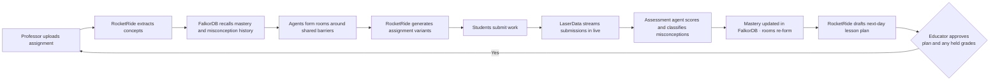
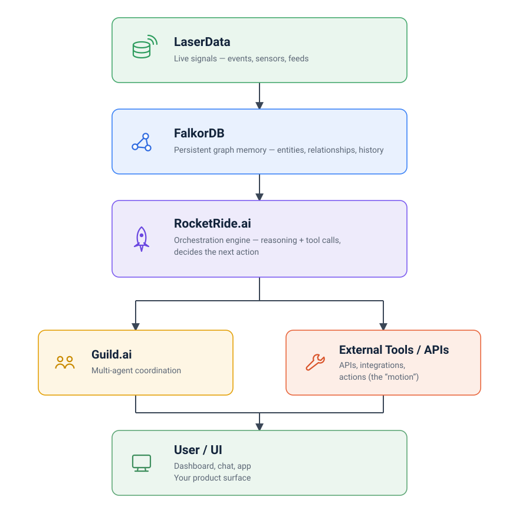
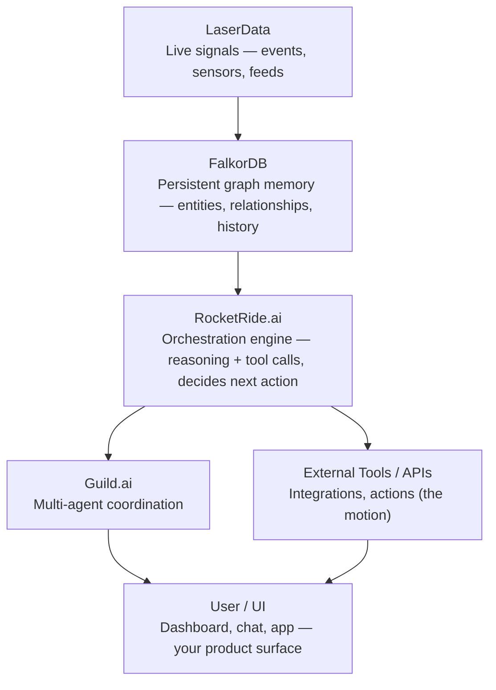

# Atrium

**A classroom with memory, in motion.**

Atrium is an agentic education platform. A professor uploads one assignment; Atrium recalls how every student has struggled before, works out *why* each one is stuck, forms temporary learning rooms around shared barriers, adapts the assignment per room without lowering rigor, grades the results, updates each student's mastery, and produces the next day's teaching plan.

The entire loop is rendered as a living isometric school that visibly rebuilds itself after every assignment.

> Built for **Memory Meets Motion** — Frontier Tower, San Francisco, August 3 2026.

---

## Table of Contents

- [The Problem](#the-problem)
- [The Core Insight](#the-core-insight)
- [How It Works](#how-it-works)
- [Architecture](#architecture)
  - [System Overview](#system-overview)
  - [The Four Layers](#the-four-layers)
  - [Request Lifecycle](#request-lifecycle)
  - [The Adapter Seam](#the-adapter-seam)
  - [Failure Behavior](#failure-behavior)
- [The Living School](#the-living-school)
- [Agent System](#agent-system)
- [Sponsor Integrations](#sponsor-integrations)
- [Repository Layout](#repository-layout)
- [Local Development](#local-development)
- [Environment Variables](#environment-variables)
- [API Routes](#api-routes)
- [Event Contract](#event-contract)
- [Testing](#testing)
- [Responsible Personalization](#responsible-personalization)
- [Project Status](#project-status)

---

## The Problem

A professor teaches one class, but that class contains many different learning histories.

Some students struggle with integer operations. Others understand the concepts but apply them in the wrong order. Some need chunked instructions, predictable sequencing, reduced visual overload, or extended time. Others are ready for advanced work.

Teachers know this. Creating, tracking, grading, and planning around every learning need at classroom scale is the part that does not fit in a human day.

Most education software records what happened *after* a student falls behind. Atrium changes what the student receives *before* the next failure.

---

## The Core Insight

Two students both score 40% on integer operations. Every gradebook in existence puts them in the same remediation bucket.

They do not have the same problem.

```
Maya   ──EXHIBITED──▶  sign_error_on_negatives  ──BLOCKS──▶  integer_operations
Devan  ──EXHIBITED──▶  operation_order_slip     ──BLOCKS──▶  integer_operations
```

Maya drops the sign when a visual number line is taken away. Devan knows the signs perfectly and applies the operations out of order. **Same score, same concept, opposite intervention.** Put them in one room and at least one of them is wasting the hour.

Finding that requires walking a relationship two hops deep — `Student → Misconception → Concept` — and grouping by the *middle* node, not the endpoint. A flat table cannot express it. A vector search over "students who failed integer operations" actively hides it, because in embedding space these two students look nearly identical.

This is why Atrium's memory is a graph, and why the grouping decision is a Cypher traversal rather than a prompt:

```cypher
MATCH (s:Student)-[:EXHIBITED]->(m:Misconception)-[:BLOCKS]->(c:Concept)
WHERE c.id IN $concepts
WITH m, c, collect(s.id) AS students
WHERE size(students) >= $minGroupSize
RETURN m.id AS barrier, c.id AS concept, students
```

Every room Atrium builds traces back to a path in that graph, and the UI will show you the path.

---

## How It Works



The demo uses a synthetic Algebra I class across four concepts: integer operations, the distributive property, equation sequencing, and combining like terms.

Students are grouped by their current academic barrier — **never** by diagnosis or accommodation label. Accessibility is a delivery layer that changes presentation, pacing, sequencing, and support while preserving the original learning objective.

---

## Architecture

The enforced target architecture is documented in [docs/ARCHITECTURE.md](docs/ARCHITECTURE.md). RocketRide is the data plane above FalkorDB and LaserData; Guild.ai manages all eight agents and is the system of record for workflow traces.

### System Overview



The stack is a single top-to-bottom pipeline, not a parallel fan-out. Live signals land first and become durable graph memory; only then does the orchestration engine reason over that memory and decide the next action, coordinating agents and calling external tools before anything reaches the product surface.

<details>
<summary>Diagram source (Mermaid)</summary>


</details>

### The Four Layers

Each mandated technology owns exactly one job. The boundaries are deliberate.

| Layer | Technology | Owns | Removing it breaks |
|---|---|---|---|
| **Memory** | FalkorDB | The classroom knowledge graph | Room formation — grouping *is* a graph traversal |
| **Live** | LaserData | Apache Iggy topic per run | The event spine and all replay |
| **Data plane** | RocketRide | Pipelines plus all FalkorDB/LaserData reads and writes | Assignment flow and durable classroom state |
| **Control plane** | Guild.ai | 8 agents, handoffs, human gates, and traces | Workflow coordination and accountable decisions |

#### A deliberate constraint

The Laser SDK also ships a knowledge graph, a KV store, and a full agent runtime. Atrium uses **only its streaming layer**.

This is not an oversight. If Laser held the graph, FalkorDB would be a decorative import; if Laser ran the agents, Guild.ai would be. Using one vendor's convenience surface to absorb another's job is how you end up with four logos and two integrations. Each layer here does work that the system cannot function without.

#### Memory — FalkorDB

The graph is the classroom's long-term memory. It compounds: every assignment writes new edges, and the next assignment reads them.

```
(Student)-[:HAS_MASTERY {level, updated_at}]->(Concept)
(Student)-[:EXHIBITED {run_id, evidence_refs, at}]->(Misconception)
(Misconception)-[:BLOCKS]->(Concept)
(Student)-[:NEEDS]->(Support)
(Student)-[:MEMBER_OF {run_id}]->(Room)
(Room)-[:FOCUSES_ON]->(Concept)
```

Queries that matter:

- `findSharedBarriers()` — the two-hop traversal that forms rooms
- `masteryTrajectory()` — one student's mastery over time, the "memory compounds" story
- `neighborhood()` — node/edge slice powering the on-screen graph panel

#### Live — LaserData

One Apache Iggy topic per run. Append-only, partitioned, ordered within a partition, with durable offsets.

Two things flow through it:

1. **Inbound** — student activity as it happens: submissions, attempts, hint requests, idle signals
2. **Outbound** — every agent event, which the SSE route forwards to the browser

Because the log is durable and offset-addressed, **replay is free**. The UI scrubber reads real offsets, so scrubbing back through a run re-reads the log rather than replaying a client-side array. Delivery is at-least-once, so every handler is idempotent.

#### Motion — RocketRide

Four `.pipe` pipelines, each a task the system cannot do without:

| Pipeline | Input | Output |
|---|---|---|
| `concept_extraction` | Uploaded assignment (PDF/image → OCR → NER) | Concepts, objectives, difficulty, constraints |
| `variant_generation` | Room barrier + base assignment | Room-level variant preserving the objective |
| `misconception_explanation` | Wrong answer + student history | Classified misconception with evidence |
| `lesson_plan_synthesis` | Updated classroom state | Next-day timeline for professor and TA |

The upload path is genuine motion: a real file enters an OCR/NER pipeline and comes out as structured concepts.

#### Agents — Guild.ai

Eight specialist agents rather than one oversized prompt. Guild provides the registry, per-agent permissions, explicit handoffs, and — most visibly — **human-in-the-loop gates**.

Two gates are mandatory and cannot be configured away:

- A low-confidence grade never publishes; it pauses and waits for a human
- The final lesson plan requires educator approval before it is issued

### Request Lifecycle

One full run, end to end:

```
1.  POST /api/runs                      run created, Iggy topic ensured
2.  assignment.uploaded                 → Laser
3.  RocketRide concept_extraction       file → OCR/NER → concepts
4.  assignment.concepts.extracted       → Laser → SSE → world reacts
5.  FalkorDB findSharedBarriers()       two-hop traversal over history
6.  student.context.ready               → Laser
7.  Grouping agent proposes rooms       grouped by barrier, not score
8.  groups.proposed                     → rooms rise in the world
9.  Accessibility agent adds overlays   delivery only, objectives fixed
10. accessibility.layers.ready
11. RocketRide variant_generation       one variant per room
12. assignment.variants.ready           → morph panel animates
13. Students submit                     → Laser ingestActivity()
14. submissions.received
15. Assessment agent grades             confidence scored per item
16. assessment.completed                low-confidence grades held for review
17. FalkorDB upsertMastery()            new edges written; memory compounds
18. student.models.updated              → students move between rooms
19. RocketRide lesson_plan_synthesis
20. lesson.plan.ready                   → tomorrow's school appears
21. approval.requested                  → Guild gate, run PAUSES
        ↓ educator approves plan + held grades via /approve-plan
```

Every one of the 11 event types is defined and Zod-validated in `src/contracts/events.ts`.

### Platform Boundaries

`src/server/platform/rocketRideDataPlane.ts` is the only application-facing route to FalkorDB and LaserData. `src/server/platform/guildWorkflow.ts` is the application-facing route to Guild agents, gates, and traces. Provider adapters are internal SDK drivers only.

```ts
await publishRunEvents(run);
await recordGuildAgentResult(runId, agent, result);
```

This buys three things:

1. **Clear ownership.** RocketRide owns data movement; Guild owns orchestration and traceability.
2. **Deterministic demos.** `SPONSOR_MODE=mock` swaps in reproducible fixtures. No network, identical output every run.
3. **Honest degradation.** Live mode is resolved *per adapter*, not globally.

### Failure Behavior

`resolveAdapterMode()` decides per adapter, on every boot:

```
SPONSOR_MODE=mock                    → mock         (default; fully offline)
SPONSOR_MODE=live + keys present     → live
SPONSOR_MODE=live + keys missing     → mock + one-time warning
```

Guild is the one exception: it has no live adapter yet, so it always resolves to mock — even in live mode with keys present — until its SDK lands.

A missing key degrades one layer. It never takes down the run. This is a demo-day property: venue wifi failing should cost a sponsor integration, not the presentation.

`GET /api/adapters/status` reports what each layer actually resolved to, so what you see on stage is what is really running.

---

## The Living School

Every backend event produces a visible change. Rooms rise when groups form, students walk between them as mastery changes, misconception symbols surface from the Assessment Forge, and a translucent "tomorrow school" appears once the next plan is ready.

| Location | Purpose |
|---|---|
| **Professor Tower** | Upload assignments, define teaching intent |
| **Memory Graph** | FalkorDB knowledge graph, live and traversable |
| **Agent Workshop** | Guild.ai specialist agents and their handoffs |
| **Signal Beacon** | LaserData stream, live offsets ticking |
| **Ember Room** | Integer-operation intervention |
| **Forge Room** | Distributive-property intervention |
| **Harbor Room** | Equation-sequencing support |
| **Summit Room** | Extension work for high-mastery students |
| **Assessment Forge** | Grading and misconception detection |
| **Planning Observatory** | Next-day teaching plan |

The renderer is hand-written: isometric projection, tile math, hit testing, particles, and an animation engine in `src/world/`, drawing to a plain canvas. No game engine dependency.

---

## Agent System

| Agent | Responsibility |
|---|---|
| **Assignment Architect** | Reads the assignment, extracts objectives, maps questions to concepts, preserves professor constraints |
| **Student Memory Agent** | Retrieves concept-relevant mastery, misconceptions, supports, and scaffolds from the graph |
| **Grouping Agent** | Forms three or four explainable rooms from shared barriers |
| **Accessibility Agent** | Adds delivery supports without altering documented accommodations or lowering expectations |
| **Assignment Curator** | Produces room-level variants plus student overlays, with objective-preservation checks |
| **Assessment Agent** | Grades submissions, classifies misconceptions, scores confidence, routes uncertain work to review |
| **Classroom Evolution Agent** | Updates mastery, misconception confidence, scaffolding, and room membership |
| **Lesson Planner** | Turns classroom state into an evidence-backed next-day timeline |

Mastery updates use Bayesian Knowledge Tracing (`src/server/mastery/`) rather than raw score averaging, so a single bad day does not erase a term of evidence.

---

## Sponsor Integrations

| Sponsor | Package | Runs | Status |
|---|---|---|---|
| FalkorDB | `falkordb@6.7.0` | Docker, local | Memory layer |
| LaserData | `@laserdata/laser-sdk` | laser-stack Docker or cloud | Live layer |
| RocketRide | `rocketride@1.3.0` | Hosted API (key required) | Motion layer |
| Guild.ai | `@guildai/agents-sdk` | Hosted (CLI auth) | Agent layer |

> **Guild.ai currently runs in mock only.** `@guildai/agents-sdk` is not on public npm — a `guild auth login` private-registry install is planned — so there is no live Guild adapter yet, and even `SPONSOR_MODE=live` falls back to the Guild mock with a one-time warning. FalkorDB, LaserData, and RocketRide each ship a live adapter.

---

## Repository Layout

```
src/
├── app/                    Next.js App Router
│   ├── api/                run, student, room, SSE, approval routes
│   ├── layout.tsx
│   └── page.tsx
├── components/
│   ├── demo/               app shell, command rail, phase timeline, toasts
│   ├── panels/             room, student, event, plan, graph detail panels
│   └── world/              canvas stage
├── contracts/              Zod schemas — agents, domain, events, ids, run
├── seed/                   synthetic Algebra I class
├── server/
│   ├── adapters/           the four sponsor adapters + the seam
│   ├── agents/             the eight specialist agents
│   ├── audit/              tamper-evident decision log
│   ├── config/             env + per-adapter mode resolution
│   ├── events/             event bus and SSE plumbing
│   ├── mastery/            Bayesian Knowledge Tracing
│   ├── motion/             RocketRide pipeline execution
│   ├── submissions/        submission preparation
│   ├── coreLoop.ts         run orchestration — the whole loop, end to end
│   ├── agentRuntime.ts     agent execution runtime
│   ├── eventBridge.ts      event bus ↔ adapter wiring
│   ├── sponsorBridge.ts    sponsor adapter wiring
│   └── runStore.ts         run state store
└── world/                  isometric renderer — iso, layout, graph, render, sim
docs/
├── CONTRACTS.md            frozen shared contracts
├── INTEGRATION_PROTOCOL.md cross-lane integration rules
└── SPRINT_PLAN.md          sprint work split and timeline
```

---

## Local Development

### 1. Install

```bash
git clone https://github.com/Da0t/Atrium.git
cd Atrium
npm install
cp .env.example .env.local
```

### 2. Mock mode — no keys, no Docker

```bash
npm run dev
```

Open [http://localhost:3001](http://localhost:3001). The complete demo runs deterministically offline.

### 3. Live mode

Start the memory and live layers locally:

```bash
# FalkorDB — memory
docker run -d -p 6379:6379 -p 3002:3000 --name falkordb falkordb/falkordb:latest

# LaserData — live
git clone https://github.com/laserdata/laser-stack && cd laser-stack
./scripts/up          # prints a connection string; copy it into .env.local
```

Then:

```bash
SPONSOR_MODE=live npm run dev
```

### Port map

Three services default to port 3000. The assignments below are already applied.

| Service | Port |
|---|---|
| Next.js dev | **3001** |
| Iggy HTTP (LaserData) | 3000 |
| Iggy TCP (LaserData) | 8090 |
| FalkorDB Redis | 6379 |
| FalkorDB Browser UI | **3002** |

Requires Node 22.14+ (the Laser SDK uses Node TCP/TLS APIs and is ESM-only) and Docker Engine 25+.

---

## Environment Variables

```bash
# mock (default, fully offline) | live
SPONSOR_MODE=mock

# Memory — FalkorDB
FALKORDB_URL=redis://127.0.0.1:6379
FALKORDB_PASSWORD=
FALKORDB_GRAPH=atrium

# Live — LaserData
LASER_CONNECTION_STRING=iggy:laser@127.0.0.1:8090
LASER_STREAM=atrium

# Motion — RocketRide
ROCKETRIDE_APIKEY=
ROCKETRIDE_URI=https://api.rocketride.ai

# Agents — Guild.ai
GUILD_API_KEY=
GUILD_WORKSPACE=
```

Variable names match each vendor SDK's own convention, so the SDKs can read `process.env` directly.

---

## API Routes

| Method | Route | Description |
|---|---|---|
| `POST` | `/api/runs` | Start a workflow run |
| `GET` | `/api/runs/:runId` | Run status |
| `GET` | `/api/runs/:runId/events` | Live event stream (SSE) |
| `GET` | `/api/runs/:runId/graph` | Knowledge-graph slice for the run (nodes + edges) |
| `POST` | `/api/runs/:runId/simulate-submissions` | Feed submissions into the live stream |
| `POST` | `/api/runs/:runId/approve-plan` | Resolve a human approval gate |
| `GET` | `/api/students/:studentId` | Student profile and trajectory |
| `GET` | `/api/rooms/:roomId` | Room detail and formation evidence |
| `GET` | `/api/adapters/status` | Per-adapter resolved mode |

---

## Event Contract

Eleven event types, frozen in `src/contracts/events.ts` and Zod-validated at the boundary:

```
assignment.uploaded              submissions.received
assignment.concepts.extracted    assessment.completed
student.context.ready            student.models.updated
groups.proposed                  lesson.plan.ready
accessibility.layers.ready       approval.requested
assignment.variants.ready
```

Every event carries `event_id`, `run_id`, `source_agent`, `timestamp`, and a typed payload.

---

## Testing

```bash
npm run lint
npm run typecheck
npm test
npm run verify:world     # renderer smoke check
```

---

## Responsible Personalization

- Students are grouped by learning need, never by disability label
- A diagnosis does not determine a fixed assignment format
- Accessibility changes delivery, not academic expectations
- Documented supports are never modified automatically
- Low-confidence grades require educator review before publishing
- Every grouping and adaptation carries evidence references
- Final grades and teaching plans remain educator-controlled
- The demo uses synthetic student data only

---

## Project Status

Atrium is a hackathon project under active development. The domain loop, contracts, agents, renderer, RocketRide data plane, and Guild control plane are built. See [docs/ARCHITECTURE.md](docs/ARCHITECTURE.md) for ownership rules and the migration plan.

---

**Most education software tells you a student fell behind. Atrium remembers why — and does something about it before tomorrow.**
