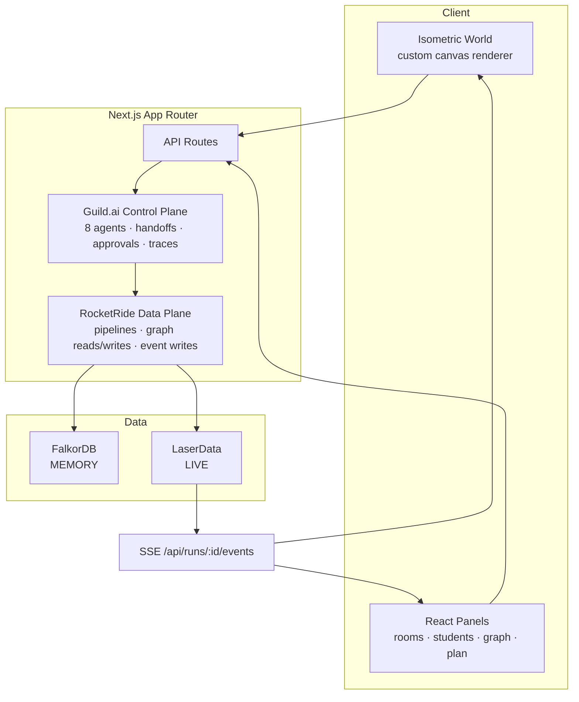

# Target Architecture

RocketRide is Atrium's data plane and Guild.ai is its workflow control plane.
The provider drivers under `src/server/adapters/` are internal infrastructure;
application code must not import them directly.

## Boundary rules

- API routes and domain workflows use `src/server/platform/rocketRideDataPlane.ts` for FalkorDB and LaserData operations. No direct `getAdapters().falkordb` or `getAdapters().laser` calls outside platform infrastructure.
- RocketRide owns pipeline execution, ordered event publication, submission ingestion, graph materialisation, graph reads, and room-formation writes. It is the sole read/write path to classroom data services.
- Domain agent functions remain deterministic and pure. `src/server/platform/guildWorkflow.ts` registers their eight Guild identities, records every result, manages approval gates, handoffs, and execution traces.
- Guild traces replace `src/server/audit/` as the authoritative audit history. API responses and new UI work should expose `traces`, never `audit`.
- `src/server/adapters/` remains only an anti-corruption layer for provider SDKs and mock/live selection. Do not add business logic there or import it from routes, agents, or submissions.

## Migration checklist

1. Move every remaining direct adapter import into a platform module.
2. Replace local `recordAudit()` calls with `trace()` from `guildWorkflow`.
3. Route agent-to-agent transitions through `guild.handoff()` and surface those records with run traces.
4. Implement `GuildAgentAdapter` against the installed Guild SDK once its private registry is configured; the current mock preserves the full target contract.
5. Retire `src/server/audit/` and migrate its tests after all callers use Guild traces.
