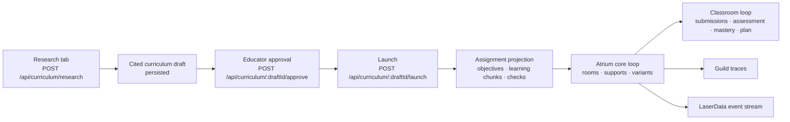

# Research-to-Launch Integration Plan

## Goal

An educator can research a topic, review the cited curriculum, approve it, and
launch that approved curriculum as an Atrium learning run. The new UI owns the
Research and Curriculum views; this contract gives it a stable backend handoff.



## UI-facing API contract

The UI should not construct an Atrium assignment itself. After a draft is
approved it calls this endpoint:

```http
POST /api/curriculum/:draftId/launch
Content-Type: application/json

{
  "launched_by": "educator",
  "teaching_intent": "Students compare supervised and unsupervised learning and explain an appropriate use case.",
  "student_cohort_id": "default"
}
```

Success returns `201` with:

```json
{
  "draft_id": "cur_...",
  "assignment_id": "asg_cur_...",
  "run_id": "run_...",
  "status": "variants_ready",
  "launch": {
    "source_citations_preserved": true,
    "review_state": "approved"
  }
}
```

The endpoint must reject a draft that is missing, rejected, pending review, or
has no citable learning chunks. It must be idempotent: repeating a successful
launch returns the existing `assignment_id` and `run_id`, not a second class
run.

## Backend implementation sequence

1. Replace the in-memory curriculum store with a repository that persists the
   draft, approval, edit revision, launch record, and `run_id`. FalkorDB can
   hold the graph relationships; the source record needs durable document/KV
   storage as well.
2. Add a `CurriculumLaunch` domain record and the launch API route. Approval is
   a prerequisite, not a client-side state check.
3. Add a projection service that turns each approved `CurriculumChunk` into an
   assignment question and each curriculum concept into an objective. Preserve
   source IDs and URLs as assignment evidence.
4. Generalize the classroom contracts from the current four Algebra-only
   `ConceptId` enum to a per-run concept registry. This includes student
   mastery, concept summaries, room focus, variants, assessment, and lesson
   planning. Existing Algebra seed runs retain their current registry.
5. Start the run through the core-loop service with the projected assignment,
   write the draft-to-assignment-to-run links, and emit `curriculum.launched`.
6. Display the run in the Curriculum tab and stream its events through
   LaserData; record research, approval, launch, and run references in Guild.

The migration in step 4 is the critical path. Reusing the fixed Algebra enum
would make a Machine Learning curriculum look launchable while causing the
student-memory and assessment agents to silently use unrelated Algebra data.

## Machine Learning smoke-test/demo

Use this as the required end-to-end acceptance case in CI (mock providers) and
as the live demo script (live Firecrawl, Guild, LaserData, FalkorDB):

1. In **Research**, submit:
   - Topic: `machine learning`
   - Audience: `high school`
   - Intent: `Distinguish supervised and unsupervised learning; evaluate one responsible classroom use case.`
   - Sources: `5`
2. Verify a cited draft with concepts, sequenced chunks, comprehension checks,
   and any evidence warnings. Assert every chunk and claim has citations.
3. Approve the draft as `educator-demo`.
4. Launch it and assert exactly one assignment and one run are linked to the
   draft. Assert the projected run concept registry contains Machine Learning
   concepts, not Algebra seed concepts.
5. Verify the first core-loop phase reaches `variants_ready`, including
   grouping, accessibility layers, and per-room variants that preserve the
   generated objectives.
6. Simulate submissions and finish the classroom phase. Assert the run reaches
   `planned`, produces assessments and a tomorrow plan, and emits a
   low-confidence review when appropriate.
7. Fetch `/api/runs/:runId/events?format=json` and assert ordered events include
   assignment upload, concept extraction, room proposal, assessment, mastery
   update, and lesson-plan events. Confirm the Guild `curriculum.launched`
   trace and the launch record preserve all source citations.

### Test split

- **Unit:** projection from an approved draft to an assignment; idempotent
  launch; rejection of unapproved/uncited drafts.
- **Integration:** dynamic concept registry through student memory, grouping,
  variants, assessments, and planning.
- **E2E:** the seven-step Machine Learning flow above. CI uses deterministic
  Firecrawl fixtures; the deploy smoke test uses the live provider with five
  results maximum.

## Ownership and merge order

- **UI teammate:** Research tab, Curriculum tab, and calls to the three
  research/approval/launch endpoints. They should render the returned launch
  status and navigate to `/demo?runId=...` (or the final run route).
- **Backend integration owner (me unless reassigned):** persistence, launch
  endpoint, projection service, dynamic concept registry, and smoke tests.
- **Provider owners:** review the FalkorDB persistence shape, Guild trace names,
  and LaserData event schema once the launch event is added.

Merge the backend contract and mock E2E coverage before connecting the UI's
Launch button. The UI can safely ship the Research and Curriculum tabs first;
until launch exists, it should show an approved draft as **ready to launch**.
